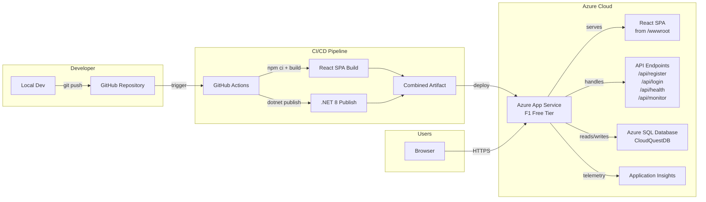

# Cloud Quest – Microsoft Azure Workshop

A professional event website for the **Cloud Quest – Microsoft Azure Workshop** hosted by **Alliance University, School of Advanced Computing** in association with **Microsoft Azure Developer Community**.

> **Speaker:** Ms. Suchitra Nayak, Technical Project Manager – Microsoft Engagement, Tech Mahindra  
> **Date:** March 14, 2026 · 10:00 AM – 01:00 PM  
> **Venue:** LT-517, LC-2  
> **Live Site:** [cloudquest-demo.azurewebsites.net](https://cloudquest-demo.azurewebsites.net)

---

## Tech Stack

| Layer | Technology |
|-------|------------|
| Frontend | React 18, Vite, CSS3 |
| Backend | .NET 8 Minimal API |
| Database | Azure SQL Database (Free tier) |
| ORM | Entity Framework Core 8 |
| Monitoring | Application Insights + Custom Metrics |
| Hosting | Azure App Service (F1 Free Tier) |
| CI/CD | GitHub Actions |

---

## Architecture Diagram



```
┌─────────────┐       ┌──────────────────┐       ┌──────────────────────────┐
│  Developer   │       │   GitHub Actions  │       │   Azure App Service      │
│              │ push  │                  │deploy │   (F1 Free Tier)         │
│  git push ──────────▶│  1. npm ci/build ────────▶│                          │
│  to main     │       │  2. dotnet publish│       │  .NET 8 Minimal API      │
│              │       │  3. zip & deploy  │       │  ├── /api/health         │
└─────────────┘       └──────────────────┘       │  ├── /api/register       │
                                                  │  ├── /api/login          │
                                                  │  ├── /api/monitor        │
                                                  │  ├── /api/workshop       │
                                                  │  └── React SPA (wwwroot) │
                                                  │         │                │
                                                  └─────────┼────────────────┘
                                                            │
                                                  ┌─────────▼────────────────┐
                                                  │  Azure SQL Database      │
                                                  │  CloudQuestDB (Free)     │
                                                  │  ├── Users table         │
                                                  │  │   ├── Id, Name, Email │
                                                  │  │   ├── PasswordHash    │
                                                  │  │   ├── FailedAttempts  │
                                                  │  │   └── LockoutEnd      │
                                                  └──────────────────────────┘
```

---

## Features

- **Hero Section** — Full-viewport with animated cloud particles, event info cards
- **Speaker Profile** — Card with expertise tags and bio
- **Workshop Agenda** — 3-session timeline with topic pills
- **Event Details** — 4-card grid (venue, date, what to bring, prerequisites)
- **Registration** — Form with strong password validation + QR code placeholder
- **Login** — Authenticates against SQL database with account lockout protection
- **Monitoring** — Real-time server metrics, request tracking, performance stats
- **Responsive Design** — Desktop, tablet, and mobile optimized

---

## Security Features

| Feature | Description |
|---------|-------------|
| Password Hashing | SHA256 hashed before storage |
| Strong Password Rules | Min 8 chars, uppercase, lowercase, number, special character |
| Account Lockout | 5 failed attempts = 15-minute lockout |
| Remaining Attempts | UI shows attempts remaining before lockout |
| No Info Leakage | Same error for wrong email and wrong password |
| Input Validation | Server + client-side validation on all fields |
| CORS Restricted | Only allows dev origin, not wildcard |
| XSS Prevention | React auto-escapes all output |
| HTTPS | Azure App Service enforces HTTPS |

---

## Repository Structure

```
CloudQuestWorkshop/
├── .github/
│   └── workflows/
│       └── azure-deploy.yml          # CI/CD pipeline
├── client/                            # React SPA (Vite)
│   ├── index.html                     # HTML entry point
│   ├── package.json                   # Node dependencies
│   ├── vite.config.js                 # Vite config (proxy + build output)
│   └── src/
│       ├── main.jsx                   # React entry point
│       ├── App.jsx                    # Root component (auth state)
│       ├── components/
│       │   ├── Navbar.jsx             # Fixed nav + mobile menu + user indicator
│       │   ├── Hero.jsx               # Hero with floating particles
│       │   ├── Speaker.jsx            # Speaker profile card
│       │   ├── Agenda.jsx             # 3-session timeline
│       │   ├── EventDetails.jsx       # 4-card info grid
│       │   ├── Registration.jsx       # Registration form + QR code
│       │   ├── Login.jsx              # Login with lockout UI
│       │   └── Footer.jsx             # Footer with links
│       └── styles/
│           └── styles.css             # All styles (1100+ lines, Azure-themed)
├── server/                            # .NET 8 Minimal API
│   ├── Program.cs                     # API + EF Core + auth + monitoring
│   ├── CloudQuestApi.csproj           # .NET project + NuGet packages
│   ├── appsettings.json               # Config + SQL connection string
│   └── Properties/
│       └── launchSettings.json        # Dev server config (port 5000)
├── CloudQuestWorkshop.sln             # Visual Studio solution
├── PROJECT_DOCS.md                    # Full project documentation
├── DEPLOYMENT.md                      # Azure deployment guide
├── README.md                          # This file
└── .gitignore                         # Git ignore rules
```

---

## Local Development

### Prerequisites

- [Node.js 18+](https://nodejs.org/)
- [.NET 8 SDK](https://dotnet.microsoft.com/download/dotnet/8.0)

### Run the backend

```bash
cd server
dotnet run
# API running at http://localhost:5000
```

### Run the frontend (separate terminal)

```bash
cd client
npm install
npm run dev
# App running at http://localhost:5173
# API calls proxied to http://localhost:5000
```

### Production build (local preview)

```bash
# Build React → server/wwwroot/
cd client
npm run build

# Run the full app from .NET
cd ../server
dotnet run
# Full app at http://localhost:5000
```

---

## API Endpoints

| Method | Endpoint | Description |
|--------|----------|-------------|
| GET | `/api/health` | Health check with uptime and environment |
| GET | `/api/workshop` | Workshop details (title, speaker, agenda) |
| POST | `/api/register` | Register with name, email, password, institution |
| POST | `/api/login` | Login with email + password (lockout after 5 fails) |
| GET | `/api/monitor` | Server metrics, traffic stats, registrations, performance |
| GET | `/api/monitor/requests` | Recent request log with response times |

### Registration payload

```json
{
  "name": "John Doe",
  "email": "john@example.com",
  "password": "MyStr0ng@Pass",
  "institution": "Alliance University"
}
```

### Password Requirements

- Minimum 8 characters
- At least one uppercase letter (A-Z)
- At least one lowercase letter (a-z)
- At least one number (0-9)
- At least one special character (!@#$%^&*)

---

## Azure Resources

| Resource | Type | SKU |
|----------|------|-----|
| `student-feedback-rg` | Resource Group | — |
| `ASP-studentfeedbackrg-be33` | App Service Plan | F1 Free |
| `cloudquest-demo` | Web App | .NET 8 |
| `cloudquest-sqlserver` | SQL Server | — |
| `CloudQuestDB` | SQL Database | Free (32MB) |

---

## Azure Deployment

See [DEPLOYMENT.md](DEPLOYMENT.md) for complete deployment instructions including:

- **Azure CLI** commands (resource group, App Service Plan F1, Web App, SQL Database)
- **GitHub Actions** CI/CD pipeline setup
- **Deployment Center** portal walkthrough

### Quick Deploy (Azure CLI)

```bash
# Login
az login

# Create resources
az group create --name rg-cloudquest --location centralindia
az appservice plan create --name plan-cloudquest --resource-group rg-cloudquest --sku F1 --is-linux
az webapp create --name cloudquest-demo --resource-group rg-cloudquest --plan plan-cloudquest --runtime "DOTNETCORE:8.0"

# Create SQL Database
az sql server create --name cloudquest-sqlserver --resource-group rg-cloudquest --location centralindia --admin-user cloudquestadmin --admin-password "YourStr0ng@Pass!"
az sql db create --resource-group rg-cloudquest --server cloudquest-sqlserver --name CloudQuestDB --edition Free
az sql server firewall-rule create --resource-group rg-cloudquest --server cloudquest-sqlserver --name AllowAzureServices --start-ip-address 0.0.0.0 --end-ip-address 0.0.0.0

# Build & deploy
cd client && npm ci && npm run build && cd ..
cd server && dotnet publish -c Release -o ../publish && cd ..
cd publish && zip -r ../deploy.zip . && cd ..
az webapp deploy --resource-group rg-cloudquest --name cloudquest-demo --src-path deploy.zip --type zip
```

---

## Monitoring

| Endpoint | What it shows |
|----------|---------------|
| `/api/health` | Server status, uptime, environment |
| `/api/monitor` | Traffic stats, success rate, registrations, response times |
| `/api/monitor/requests` | Last 50 HTTP requests with path, status, duration |

Application Insights provides additional telemetry in the Azure Portal: request traces, exceptions, dependencies, and performance data.

---

## Workshop Agenda

| Time | Topic |
|------|-------|
| 10:00 – 11:00 AM | Introduction to Cloud Native Architecture & Azure Fundamentals |
| 11:00 – 12:00 PM | Fundamentals of UI Design, Security & App Deployment Basics |
| 12:00 – 01:00 PM | UI Development, App Deployment & End-to-End Monitoring |

---

## License

This project is for educational purposes as part of the Cloud Quest – Microsoft Azure Workshop.
