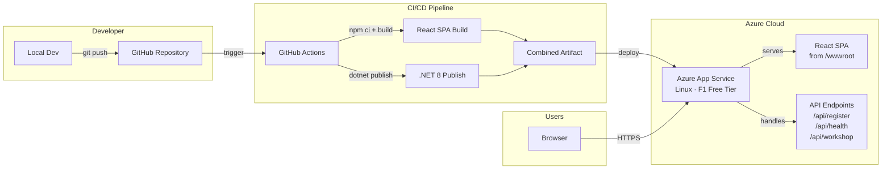

# Cloud Quest – Microsoft Azure Workshop

A professional event website for the **Cloud Quest – Microsoft Azure Workshop** hosted by **Alliance University, School of Advanced Computing** in association with **Microsoft Azure Developer Community**.

> **Speaker:** Ms. Suchitra Nayak, Technical Project Manager – Microsoft Engagement, Tech Mahindra  
> **Date:** March 14, 2026 · 10:00 AM – 01:00 PM  
> **Venue:** LT-517, LC-2

---

## Tech Stack

| Layer | Technology |
|-------|------------|
| Frontend | React 18, Vite, CSS3 |
| Backend | .NET 8 Minimal API |
| Hosting | Azure App Service (F1 Free Tier) |
| CI/CD | GitHub Actions |

---

## Architecture Diagram



```
┌─────────────┐       ┌──────────────────┐       ┌──────────────────────────┐
│  Developer   │       │   GitHub Actions  │       │   Azure App Service      │
│              │ push  │                  │deploy │   (Linux, F1 Free)       │
│  git push ──────────▶│  1. npm ci/build ────────▶│                          │
│  to main     │       │  2. dotnet publish│       │  .NET 8 Minimal API      │
│              │       │  3. zip & deploy  │       │  ├── /api/health         │
└─────────────┘       └──────────────────┘       │  ├── /api/register       │
                                                  │  ├── /api/workshop       │
                                                  │  └── React SPA (wwwroot) │
                                                  │      └── index.html      │
                                                  └──────────────────────────┘
```

---

## Repository Structure

```
CloudQuestWorkshop/
├── .github/
│   └── workflows/
│       └── azure-deploy.yml        # CI/CD pipeline
├── client/                          # React SPA (Vite)
│   ├── index.html                   # HTML entry point
│   ├── package.json                 # Node dependencies
│   ├── vite.config.js               # Vite config (proxy + build output)
│   └── src/
│       ├── main.jsx                 # React entry point
│       ├── App.jsx                  # Root component
│       ├── components/
│       │   ├── Navbar.jsx           # Fixed navigation bar
│       │   ├── Hero.jsx             # Hero section with event info
│       │   ├── Speaker.jsx          # Speaker profile card
│       │   ├── Agenda.jsx           # Workshop timeline
│       │   ├── EventDetails.jsx     # Venue, date, prerequisites
│       │   ├── Registration.jsx     # Registration form + QR code
│       │   └── Footer.jsx           # Footer with links
│       └── styles/
│           └── styles.css           # All styles (Azure-themed)
├── server/                          # .NET 8 Minimal API
│   ├── Program.cs                   # API endpoints + SPA hosting
│   ├── CloudQuestApi.csproj         # .NET project file
│   ├── appsettings.json             # App configuration
│   └── Properties/
│       └── launchSettings.json      # Dev server config (port 5000)
├── CloudQuestWorkshop.sln           # Visual Studio solution
├── DEPLOYMENT.md                    # Azure deployment guide
├── README.md                        # This file
└── .gitignore                       # Git ignore rules
```

---

## Local Development

### Prerequisites

- [Node.js 18+](https://nodejs.org/)
- [.NET 8 SDK](https://dotnet.microsoft.com/download/dotnet/8.0)

### Run the backend

```bash
cd server
dotnet run
# API running at http://localhost:5000
```

### Run the frontend (separate terminal)

```bash
cd client
npm install
npm run dev
# App running at http://localhost:5173
# API calls proxied to http://localhost:5000
```

### Production build (local preview)

```bash
# Build React → server/wwwroot/
cd client
npm run build

# Run the full app from .NET
cd ../server
dotnet run
# Full app at http://localhost:5000
```

---

## API Endpoints

| Method | Endpoint | Description |
|--------|----------|-------------|
| GET | `/api/health` | Health check for Azure monitoring |
| GET | `/api/workshop` | Workshop details (title, speaker, agenda) |
| POST | `/api/register` | Register for the workshop |

### Registration payload

```json
{
  "name": "John Doe",
  "email": "john@example.com",
  "institution": "Alliance University"
}
```

---

## Azure Deployment

See [DEPLOYMENT.md](DEPLOYMENT.md) for complete deployment instructions including:

- **Azure CLI** commands (resource group, App Service Plan F1, Web App)
- **GitHub Actions** CI/CD pipeline setup
- **Deployment Center** portal walkthrough

### Quick Deploy (Azure CLI)

```bash
# Login
az login

# Create resources
az group create --name rg-cloudquest --location centralindia
az appservice plan create --name plan-cloudquest --resource-group rg-cloudquest --sku F1 --is-linux
az webapp create --name cloudquest-workshop --resource-group rg-cloudquest --plan plan-cloudquest --runtime "DOTNETCORE:8.0"

# Build & deploy
cd client && npm ci && npm run build && cd ..
cd server && dotnet publish -c Release -o ../publish && cd ..
cd publish && zip -r ../deploy.zip . && cd ..
az webapp deploy --resource-group rg-cloudquest --name cloudquest-workshop --src-path deploy.zip --type zip
```

---

## Workshop Agenda

| Time | Topic |
|------|-------|
| 10:00 – 11:00 AM | Introduction to Cloud Native Architecture & Azure Fundamentals |
| 11:00 – 12:00 PM | Fundamentals of UI Design, Security & App Deployment Basics |
| 12:00 – 01:00 PM | UI Development, App Deployment & End-to-End Monitoring |

---

## License

This project is for educational purposes as part of the Cloud Quest – Microsoft Azure Workshop.
